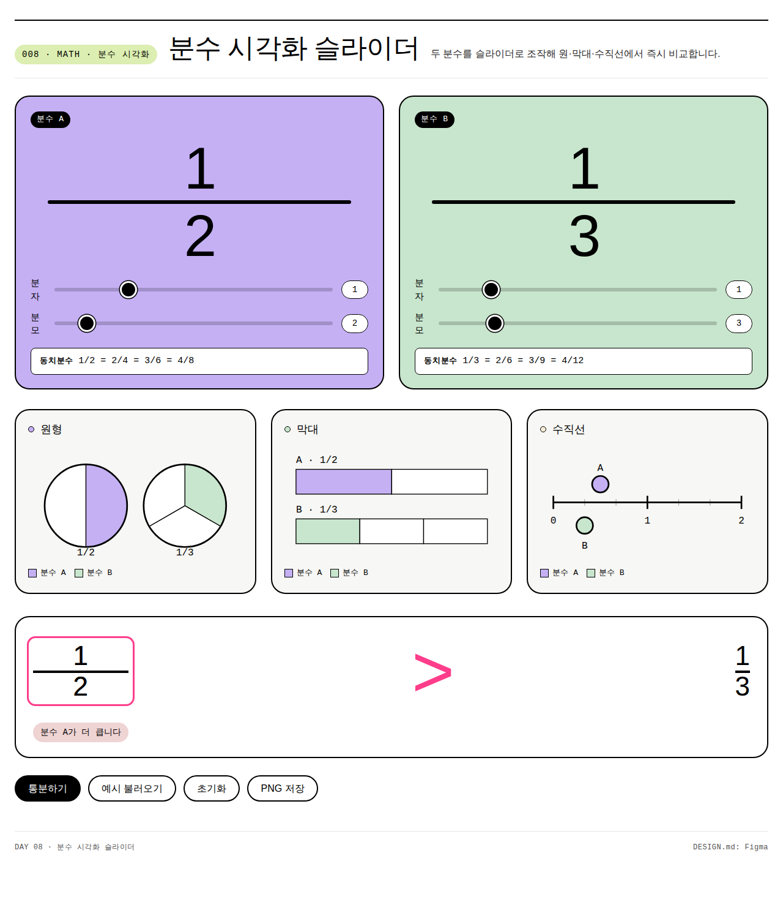

# Day 08 · 분수 시각화 슬라이더

> 100-Day Vibe Coding Kit (#008) · 수학 · 초등 4~5학년

**바로 사용**: https://989-alt.github.io/project-08-bunsu-sigakhwa-seullaideo/

분자·분모를 슬라이더로 조작하면 원·막대·수직선 그림이 동시에 바뀌어, 두 분수의 크기를 한 화면에서 비교합니다. TV 시연(전체)과 1:1(개별 탐구) 모두에 적합합니다.

## 핵심 기능

- **분수 2개 독립 슬라이더**: 각 분수의 분자(0~분모×2)·분모(1~12)를 슬라이더 또는 숫자 박스로 조작.
- **3종 동시 시각화**: 원형(파이) · 막대(가로 바) · 수직선(0~2). 슬라이더 값 변경 시 즉시 갱신.
- **크기 비교**: 큼지막한 `<` / `=` / `>` 기호 + magenta 박스 강조로 더 큰 쪽 표시.
- **동치분수 자동 나열**: 1/2 = 2/4 = 3/6 = 4/8 형식으로 4개 자동 표기.
- **통분 시뮬레이션**: 클릭 한 번에 두 분수를 LCM 공통 분모로 변환. 변환 식 표시.
- **대분수 변환**: 가분수일 때 자동으로 대분수 표기 (7/4 → 1과 3/4).
- **PNG 저장**: 현재 화면 3종 시각화를 PNG 한 장으로 다운로드. 판서 자료로 활용.
- **예시 1초 로드**: 자주 쓰이는 비교 쌍 (1/2 vs 1/3, 2/3 vs 3/4 등) 빠른 순회.

## 실행 방법

이 프로젝트는 단일 HTML 파일이라 어떤 정적 서버에서도 즉시 실행됩니다.

### 1) Pages에서 바로 (권장)
https://989-alt.github.io/project-08-bunsu-sigakhwa-seullaideo/

### 2) 로컬 (다운로드 후)
```bash
python3 -m http.server 5180 --bind 127.0.0.1
# 브라우저에서 http://127.0.0.1:5180/
```

### 3) 파일 더블클릭
`index.html` 을 그냥 더블클릭해도 작동 (CDN 의존 0).

## 스크린샷



## 기술 스택

- **단일 HTML**: `index.html` 하나에 모든 마크업·스타일·스크립트 포함.
- **Vanilla CSS**: Figma DESIGN.md 톤 (흑백 에디토리얼 + 파스텔 컬러 블록).
- **Vanilla JS**: 의존성 0. `Math`·`SVG` 만으로 그래픽 처리.
- **SVG**: 원형·막대·수직선 모두 인라인 SVG (반응형, 텍스트 검색 가능).
- **PNG 저장**: SVG → `` → `<canvas>` → `canvas.toBlob()` 으로 변환.

CDN·빌드 도구·서버·DB **0개**.

## 접근성

- 모든 슬라이더: `<input type="range">` 네이티브 키보드 지원 (←/→).
- 모든 인터랙티브 요소: 검정 4px focus outline (Figma 톤).
- 색 대비: 본문 `#000` on `#ffffff` (21:1), 컬러 블록 위 텍스트 12:1 이상.
- 비교 결과는 색·기호·텍스트 3중으로 표시 (색 외 정보 보장).
- `prefers-reduced-motion: reduce` 존중.
- 380px 모바일까지 가로 스크롤 없이 작동.

## 데이터·개인정보

- 학생 입력 **저장 안 함** (휘발성).
- localStorage 사용 안 함.
- 외부 서버 통신 **없음** (네트워크 요청 0).

## 적용한 skill

| 단계 | skill |
|---|---|
| Brainstorm | `brainstorming` |
| UI/UX | `ui-ux-pro-max` + Figma DESIGN.md |
| 코드 작성 | `senior-devops` (품질 원칙 부분만) |
| Test | `webapp-testing` + Playwright |

## 디자인 브랜드

**Figma** — 흑백 에디토리얼 캔버스 + 큼지막한 파스텔 컬러 블록 (lilac / mint / lime / cream / pink).

## 라이선스

학교 현장에서 자유 사용. 무료. 출처: 100-Day Vibe Coding Kit.
